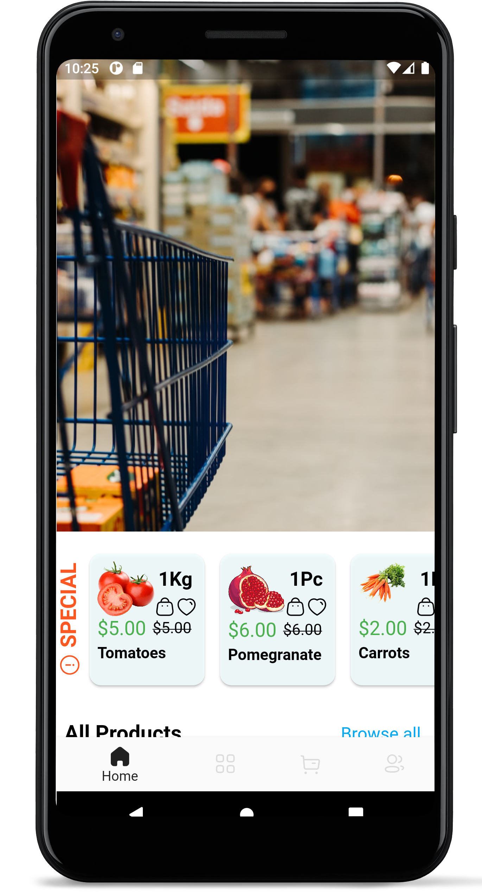
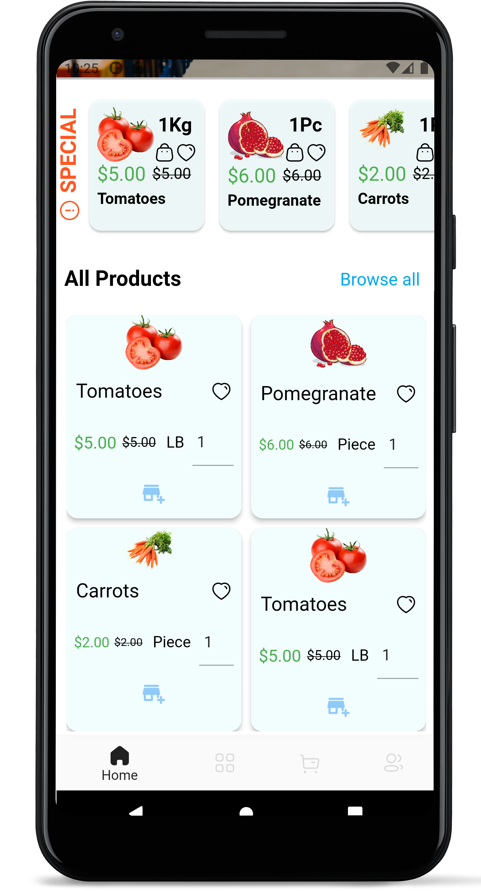
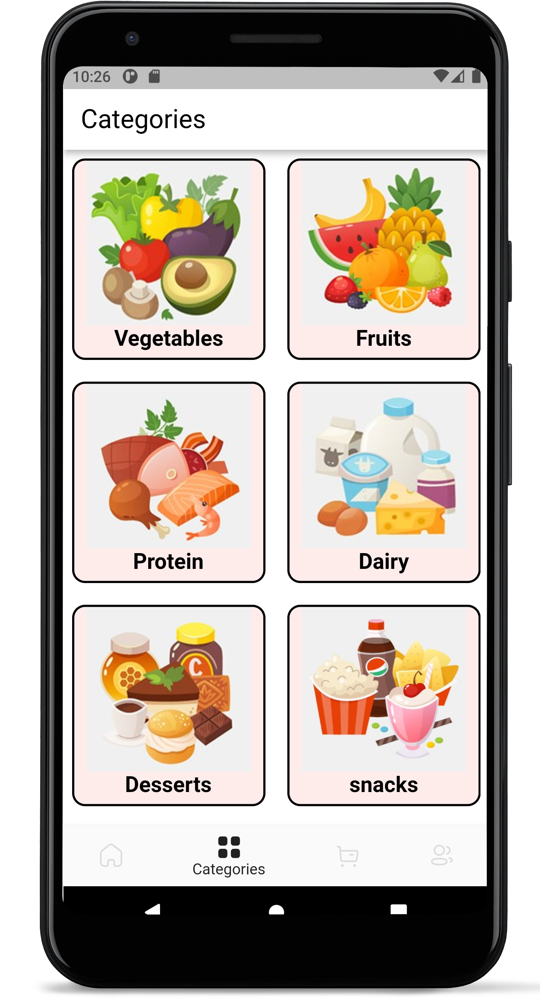
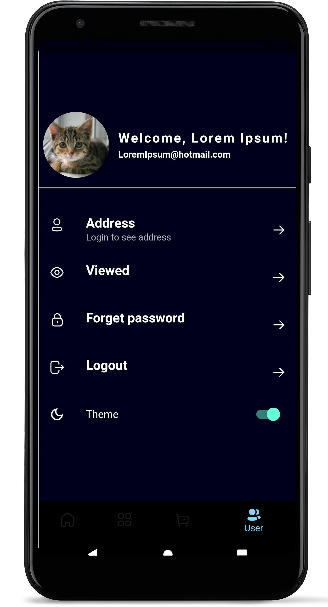
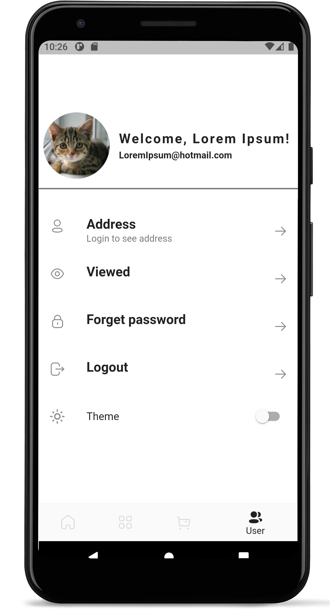
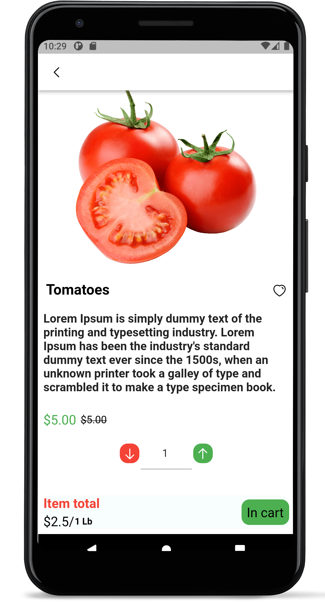
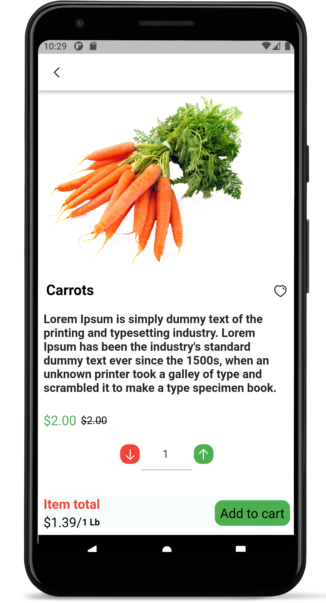
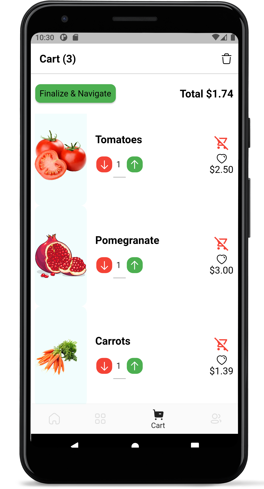
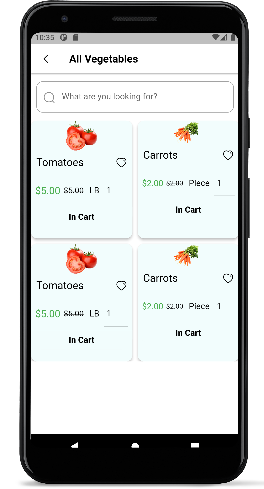

# Graduation-Project-UI
This's a repo for my contribution of the graduation project work. I'll be building a mobile app that supports the team needs.

# Final Results:

  
  
  
  
  
  
  
  
  
  

